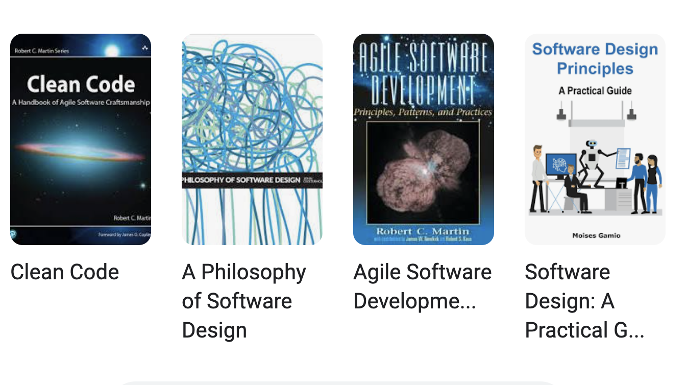
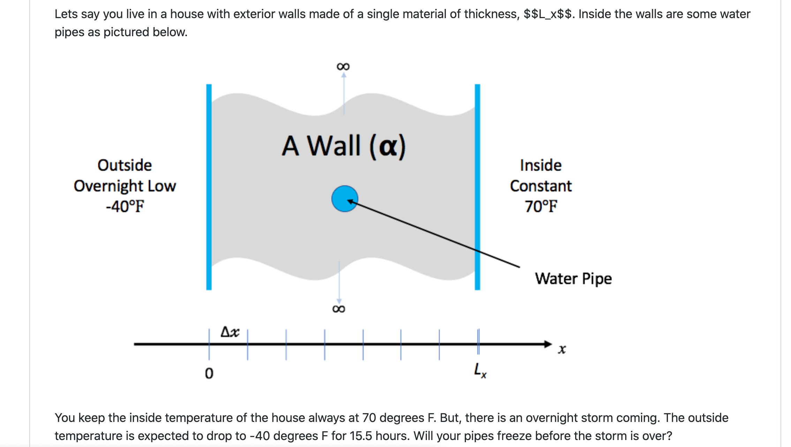

# Scientific Software Design

# Anshu Dubey (ANL)
Abhishek 
Contributions from Mark C. Miller (LLNL)

# General Design Principles for Maintainable Software

* _Some definitions from the web_
* _Encapsulate what varies_
* _Favor composition over inheritance_
* _Program to interfaces not implementations_
* _Loose coupling – interacting components should have minimal knowledge about each other_
* _SOLID_
* _https://_  _bootcamp\.uxdesign\.cc_  _/software\-design\-principles\-every\-developers\-should\-know\-23d24735518e_

* _SOLID_
* _Single responsibility_
  * _Class/method/function should do only one thing_
* _Open/closed_
  * _Open for extension\, close for modification_
* _Liskov_  _ substitution_
  * _Implementations of an interface should give same result_
* _Interface segregation_
  * _Client should not have to use methods it does not need_
* _Dependency inversion_
  * _High level modules should not depend on low level modules\, only on abstractions_

* _Found on the web_
* _Encapsulate what varies_
* _Favor composition over inheritance_
* _Program to interfaces not implementations_
* _Loose coupling – interacting components should have minimal knowledge about each other_
* _SOLID_
* _https://_  _bootcamp\.uxdesign\.cc_  _/software\-design\-principles\-every\-developers\-should\-know\-23d24735518e_

# Books on the Topic

…\. and many more

So why

this module?

…\. and many more

# Motivation and Objectives

* The same reason as for taking other courses even when they have good textbooks
  * A practitioner with experience can make the ideas more accessible
  * Instructor can perceive when attendees are not following
    * Can try to present the same idea with a different approach and/or perspective
    * Works only when students are engaged and interacting –  _so please interact \!_
* Research software needs some tweaks and additions
  * Some challenges are unique to RS\, not covered in the literature
  * Sometimes straight adoption of principles can be counterproductive

In this module we will discuss various good design practices\, explain their motivation\, discuss where tweaks are needed for research software and tell you about what we do based on our experience and challenges we faced in designing maintainable RS

# Some Research Software Challenges

Many parts of the model and software system can be under research

Requirements change throughout the lifecycle as knowledge grows

Verification complicated by floating point representation

Real world is messy

More Scientific Understanding

More Hardware

Resources

Higher Fidelity

Model

More Diverse

Solvers

# SOLID Principles Pose Some Difficulties

* _Single responsibility_
  * _Class/method/function should do only one thing_
* _Open/closed_
  * _Open for extension\, close for modification_
* _Liskov_  _ substitution_
  * _Implementations of an interface should give same result_
* _Interface segregation_
  * _Client should not have to use methods it does not need_
* _Dependency inversion_
  * _High level modules should not depend on low level modules\, only on abstractions_

* _Function calls hav_  _e overheads_
  * _Performance matters – quick turnaround of results desirable_
* _New insights may cause modification_
  * _May lead to unmaintainable code duplication_
* _It is not always possible to eliminate lateral interactions_
* _Not always possible _

# Additional Considerations for Research Software

* _Considerations_
* _Multidisciplinary _
  * _Many facets of knowledge_
  * _To know everything is not feasible_
* _Two types of code components_
  * _Infrastructure \(mesh/IO/runtime …\)_
  * _Science models \(numerical methods\)_
* _Codes grow_
  * _New ideas => new features_
  * _Code reuse by others _

* _Design Implications_
* _Separation of Concerns_
  * _Shield developers from unnecessary complexities_
* _Work with different lifecycles_
  * _Long\-lasting vs quick changing_
  * _Logically vs mathematically complex_
* _Extensibility built in_
  * _Ease of adding new capabilities_
  * _Customizing existing capabilities_

# The Running Example

# Designing Software – High Level Phases

Requirements

gathering

Decomposition

Features and capabilities

Constraints

Limitations

Target users

Other …\.\.

Understand design space

Decompose into high level components

Bin components into types

Understand component hierarchy

Figure out connectivity among components

Articulate dependencies

# Requirement gathering

Basic Requirements

Additional Requirements

* To solve heat equation we need:
  * a discretization scheme
  * a driver for running and book\-keeping
  * an integration method to evolve solution
  * Initial conditions
  * Boundary conditions
* To make sure that we are doing it correctly we need:
  * Ways to inspect the results
  * Ways of verification

* We want to have more than one way of integration
* We want to be able to select one of them at runtime
* We want to use simple build
* We want outputs to be generated in a separate folder

# Decomposition

* This is a small design space
* Several requirements can directly map to components – in this instance functions
  * Driver
  * Initialization – data containers
  * Mesh initialization – applying initial conditions
  * Integrator
  * I/O
  * Boundary conditions
  * Comparison utility

* Binning components
* Components that will work for any application of heat equation
  * Driver
  * Initialization – data containers
  * I/O
  * Comparison utility
* Components that are
  * Mesh initialization – applying initial conditions
  * Integrator
  * Boundary conditions

# Connectivity

Mesh generation

Initialize

Data containers

Boundary conditions

Initial conditions

# Connectivity – alternative possibility

Mesh generation

Initialize

Data containers

Boundary conditions

Initial conditions

# Interactive Portion

\-\- link to a google slide for designing components

# Components Design – Service Providers

* We are using finite difference discretization with explicit methods
* Driver
  * void main\(\)
* Initialization – allocate data containers
  * static __ __ void __ initialize__ \(int n\)
* I/O
  * __process\_args__ \(int argc\, char \*\*argv\)
  * void  __write\_array__ \(int t\, int n\, double dx\, double const \*a\)
* Comparison utility
  * double  __l2\_norm__ \(int n\, double const \*a\, double const \*b\)

# Components Design – Problem specific

bool  __update\_solution\_crankn__ \(int n\, double \*curr\, double const \*last\, double const \*cn\_Amat\, double bc\_0\, double bc\_1\)

bool  __update\_solution\_upwind15__ \(int n\, double \*curr\, double const \*last\, double alpha\, double dx\, double dt\, double bc\_0\, double bc\_1\)

bool  __update\_solution\_ftcs__ \( int n\, double \*uk1\, double const \*uk0\, double alpha\, double dx\, double dt\, double bc0\, double bc1\)

void  __compute\_exact\_solution__ \(int n\, double \*a\, double dx\, char const \*ic\, double alpha\, double t\, double bc0\, double bc1\)

# More Complex Application Design – Sedov Blast Wave

__Description__

High pressure at the center cause a shock to moves out in a circle\. High resolution is needed only at and near the shock

* __Requirements __
* Adaptive mesh refinement
  * Easiest with finite volume methods
* Driver
* I/O
* Initial condition
* Boundary condition
* Shock Hydrodynamics
* Ideal gas equation of state
* Method of verification

# Deeper Dive into Requirements

* Adaptive mesh refinement => divide domain into blocks
  * Blocks need halos to be filled with values from neighbors or boundary conditions
    * At fine\-coarse boundaries there is interpolation and restriction
  * Blocks are dynamic\, go in and out of existence
  * Conservation needs reconciliation at fine\-coarse boundaries
* Shock hydrodynamics
  * Solver for Euler’s equations at discontinuities
  * EOS provides closure
  * Riemann solver
  * Halo cells are fine\-coarse boundaries need EOS after interpolation
* Method of verification
  * An indirect way of checking – shock distance traveled can be computed analytically

# Components

* __Deeper Dive into some Components__
* Driver
  * Iterate over blocks
  * Implement connectivity
* Mesh
  * Data containers
  * Halo cell fill\, including application of boundary conditions
  * Reconciliation of quantities at fine\-coarse block boundaries
  * Remesh when refinement patterns change
* I/O
  * Getting runtime parameters and possibly initial conditions
  * Writing checkpoint and analysis data

* __Binned Components__
* Unchanging or slow changing infrastructure
  * Mesh
  * I/O
  * Driver
  * Comparison utility
* Components evolving with research – physics solvers
  * Initial and boundary conditions
  * Hydrodynamics
  * EOS

# Connectivity

Initial conditions

Boundary conditions

# Exploring design space -- Abstractions

* Virtual view of functionalities
* Decomposition into components

Spatial

decomposition

Virtual view :

domain sections

as stand\-alone

computation unit

Real view : A

whole domain

with many

operators

base

abstraction

Virtual view

collection of

components

Functional

decomposition

__Constraints__

Only infrastructure components have global view

All physics solvers have block view only

__Other Design Considerations__

Data scoping

Interfaces in the API

* Virtual view of functionalities
* Decomposition into components

Spatial

decomposition

Virtual view :

domain sections

as stand\-alone

computation unit

Real view : A

whole domain

with many

operators

base

abstraction

Virtual view

collection of

components

Functional

decomposition

__Constraints__

Only infrastructure components have global view

All physics solvers have block view only

__Other Design Considerations__

Data scoping

Interfaces in the API

* Virtual view of functionalities
* Decomposition into components

Spatial

decomposition

Virtual view :

domain sections

as stand\-alone

computation unit

Real view : A

whole domain

with many

operators

base

abstraction

Minimal Mesh API

Initialize\_mesh

Halo\_fill

Access\_to\_data\_containers

Reconcile\_fluxes

Regrid

Virtual view

collection of

components

Functional

decomposition

# A Design Model for Separation of Concerns

Software Architecture API  Design

# Separation of Concerns Applied

* Virtual view of functionalities
* Decomposition into units and definition of interfaces

Parallelization

and scaling

optimization

Spatial

decomposition

Virtual view :

domain sections

as stand\-alone

computation unit

Implemented by

domain experts

and applied

mathematicians

Implemented by

software and

performance

engineers

Real view : A

whole domain

with many

operators

Memory

access and

compute

optimization

Virtual view

collection of

components

Functional

decomposition

HPC Computational Science Use\-case

Heterogeneous

models

More Scientific Understanding

Software complexity

Distributed

memory

model

More Hardware

Resources

Higher Fidelity

Model

Platform complexity

More Diverse

Solvers

# Takeaways Until Now

Differentiate between slow changing and fast changing components of your code

Understand the requirements of your infrastructure

Implement separation of concerns

Design with portability\, extensibility\, reproducibility and maintainability in mind

Do not design with a specific programming model in mind

Software complexity

Distributed

memory

model

Platform complexity

# A New Paradigm Because of Platform Heterogeneity

Heterogeneous

models

Software complexity

Question \- do the design principles change?

Platform complexity

Heterogeneous

models

Software complexity

Question \- do the design principles change?

The answer is – not really

The details get more involved

Platform complexity

# A Design Model for Separation of Concerns

Software Architecture API  Design

This is where maximum

change is likely

# Features and Abstractions that must Come in

Real view : A

whole domain

with many

operators

Virtual view :

domain sections

as stand\-alone

computation unit

Spatial

Decomposition

Blocks/tiles

Load Distribution

Offloading

and scaling

optimization

Runtime

management

Virtual view

collection of

components

Functional

decomposition

Memory

access and

compute

optimization

Abstraction at

solver level

code

transformation

Real view : A

whole domain

with many

operators

Virtual view :

domain sections

as stand\-alone

computation unit

Spatial

Decomposition

Blocks/tiles

Load Distribution

Offloading

and scaling

optimization

Runtime

management

Virtual view

collection of

components

Functional

decomposition

Memory

access and

compute

optimization

Abstraction at

solver level

code

transformation

# Platform Heterogeneity

Other acceler\-ators

Cache hierar\-chy

Other accelero\-ators

Cache hierar\-chy

Other acceler\-ators

Cache hierar\-chy

Other acceler\-ators

And memory access models: unified memory / gpu\-direct / explicit transfer

# Mechanisms Needed by the Code

Mechanisms to unify expression of computation

Minimize maintained variants of source suitable for all computational devices

Reconcile differences in data structures

Mechanisms to unify expression of computation

Minimize maintained variants of source suitable for all computational devices

Reconcile differences in data structures

* Mechanisms to move work and data to computational targets
* Moving between devices
  * Launching work at the destination
  * Hiding latency of movement
* Moving data off node

Mechanisms to unify expression of computation

Minimize maintained variants of source suitable for all computational devices

Reconcile differences in data structures

* Mechanisms to move work and data to computational targets
* Moving between devices
  * Launching work at the destination
  * Hiding latency of movement
* Moving data off node

* Mechanisms to map work to computational targets
* Figuring out the map
  * Expression of dependencies
  * Cost models
* Expressing the map

Mechanisms to unify expression of computation

Minimize maintained variants of source suitable for all computational devices

Reconcile differences in data structures

* Mechanisms to move work and data to computational targets
* Moving between devices
  * Launching work at the destination
  * Hiding latency of movement
* Moving data off node

So\, what do we need?

Abstractions layers

Code transformation tools

Data movement orchestrators

* Mechanisms to map work to computational targets
* Figuring out the map
  * Expression of dependencies
  * Cost models
* Expressing the map

# Underlying Ideas: Unification of Computational Expressions

__Make the same code work on different devices__

* _Same algorithm different data layouts or operation sequence:_
  * A way to let compiler know that ”this” expression can be specialized in many ways
  * Definition of specializations
  * Often done with template meta\-programming

* _More challenging if algorithms need to be fundamentally different_
  * Support for alternatives

# Underlying Ideas: Moving Work and Data to the Target

__Parallelization Models__

* __Hierarchy in domain decomposition__
  * Distributed memory model at node level – still very prevalent\, likely to remain so for a while
  * Also done with PGAS models – shared with locality being important

__Assigning work within the node__

“Parallel For” or directives with  unified memory

Directives or specific programming model for explicit data movement

_More complex data orchestration system for asynchronous computation_

Task based work distribution

# Underlying Ideas: Mapping Work to Targets

__This is how many abstraction layers work__

Infer the structure of the code

Infer the map between algorithms and devices

Infer the data movements

Map computations to devices

These are specified either through constructs or pragmas

__It can also be the end user who figures out the mapping__

__In either case performance depends upon how well the mapping is done__

# Mechanisms Needed by the Code : Example Flash-X

Mechanisms to unify expression of computation

Macros with inheritance

Mechanisms to unify expression of computation

Macros with inheritance

Mechanisms to move work and data to computational targets

Domain specific runtime

Mechanisms to unify expression of computation

Macros with inheritance

Mechanisms to move work and data to computational targets

Domain specific runtime

Mechanisms to map work to computational targets

DSL for recipes with code generator

Mechanisms to unify expression of computation

Macros with inheritance

Mechanisms to move work and data to computational targets

Domain specific runtime

Mechanisms to map work to computational targets

DSL for recipes with code generator

Composability in the source

A toolset of each mechanism

Independent tool sets

# Overview of Flash-X Design Approach with Separation of Concerns in tools

Static physics code

Encoded with macros

Including optimization hints as directives

Source code for time

stepping

and

runtime pipeline

Library of runtime configurations

Library of templates for time\-stepping

Platform specific information

Recipe for control flow in time

stepping

Source code for physics operators

code for target device

Fully assembled and configured source code

Recipe translator

Human in the loop

